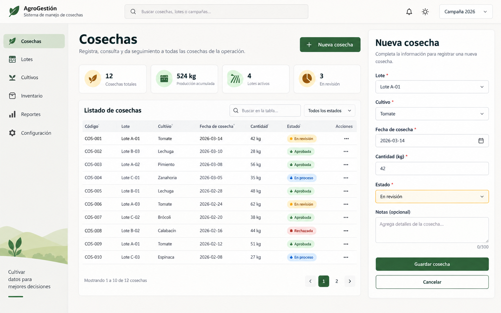
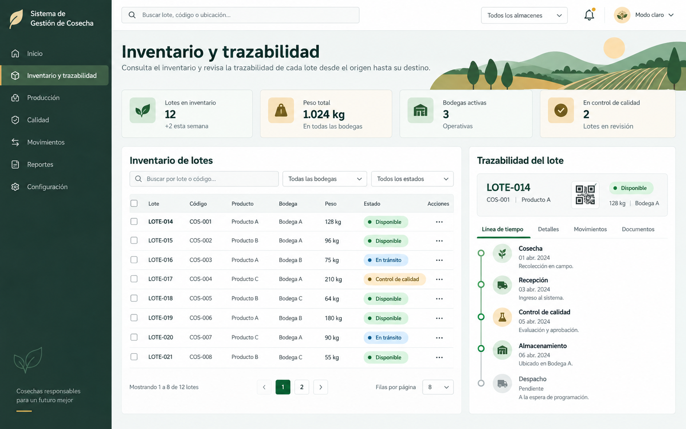
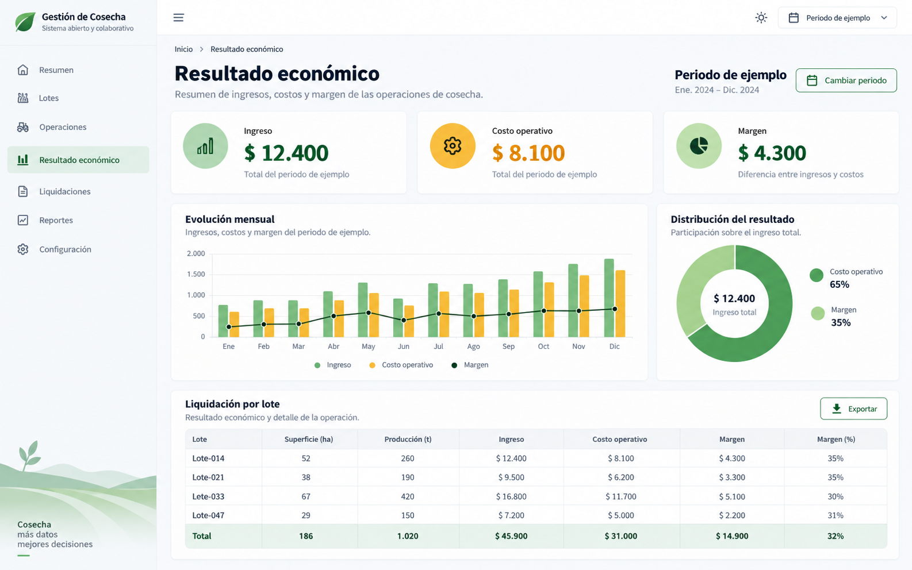

# LaraTrufas

Sistema de gestión, trazabilidad e inventario para operaciones de cosecha.

## Problema que resuelve

Las operaciones de campo suelen quedar repartidas entre planillas, cuadernos y mensajes, lo que dificulta conocer el origen de cada lote, controlar el inventario disponible y entender el resultado económico de una temporada. LaraTrufas reúne esa información en una sola aplicación para mantener una cadena de datos consistente desde el campo hasta la liquidación.

## Flujo de trabajo

```text
Cosecha → Operaciones → Inventario → Beneficio
```

1. Se registra la cosecha por lote, fecha, especie y cantidad.
2. Se coordinan las operaciones de campo y los recursos asociados.
3. La producción se agrupa en lotes, se mueve por inventario y conserva su trazabilidad.
4. Las liquidaciones y reportes conectan los ingresos y costos con el resultado económico.

## Funcionalidades

- Gestión de predios, cuarteles, plantas y tipos de cultivo.
- Registro individual y masivo de cosechas, con detalle por lote y lectura de QR.
- Operaciones y tareas de campo con herramientas, maquinaria y comentarios.
- Inventario por lote, lotes de producción, movimientos e información de trazabilidad.
- Catálogos de productos, importadores y liquidaciones.
- Paneles, gráficas y resultado económico de las operaciones.
- Roles y permisos para administrar el acceso a las funcionalidades.

## Capturas anonimizadas

Las siguientes imágenes son maquetas generadas para este repositorio. Todos los códigos, cifras, fechas y rótulos representan datos de ejemplo; no proceden de clientes, personas ni entornos reales.

### Listado y registro de cosechas



### Inventario y trazabilidad de lotes



### Resultado económico ilustrativo



## Tecnologías

- PHP y Laravel.
- Vue 3, Inertia.js, PrimeVue y Tailwind CSS.
- Vite para los recursos del cliente.
- MySQL para el entorno local de ejemplo.
- Spatie Laravel Permission para roles y permisos.
- ApexCharts, lector QR y herramientas de importación/exportación.

## Ejecutar localmente con datos de ejemplo

### Requisitos

- PHP 8.2 o superior y Composer 2.
- Node.js LTS y npm.
- MySQL 8 o una instancia compatible disponible en el equipo local.

### Instalación

```bash
git clone <URL_DEL_REPOSITORIO> laratrufas
cd laratrufas
cp .env.example .env
composer install
npm ci
```

Edita únicamente el archivo local `.env` para apuntar a una base de datos vacía creada para pruebas. El archivo de ejemplo propone los valores `harvest_management_demo`; no copies configuraciones, usuarios, contraseñas ni datos desde un ambiente de clientes.

Después, prepara la aplicación y carga las muestras:

```bash
php artisan key:generate
php artisan migrate:fresh --seed
npm run dev
php artisan serve
```

En otra terminal, deja `npm run dev` activo mientras desarrollas. La aplicación se abrirá en la dirección local mostrada por `php artisan serve`.

El seeder crea solo una cuenta ficticia para desarrollo local:

- Correo: `admin@example.test`
- Contraseña: `local-demo-only`

El dominio `example.test` está reservado para ejemplos. Esas credenciales no deben usarse fuera de una base de datos local desechable. El seeder está bloqueado fuera del entorno `local` para evitar que se creen cuentas de demostración en entornos compartidos o productivos.

Para ejecutar las pruebas automatizadas:

```bash
php artisan test
```

## Privacidad y seguridad

- Los seeders y las capturas usan datos sintéticos; no contienen personas, clientes, contactos ni resultados reales.
- Las configuraciones privadas viven exclusivamente en `.env`; las variantes de ese archivo se ignoran por defecto, salvo `.env.example`.
- Los registros locales, la información de depuración y los archivos de almacenamiento no deben versionarse.
- Antes de compartir datos reales, aplica controles de acceso, minimización de datos y una política de retención acorde a tu organización.
- Si alguna credencial llega a un repositorio público, revócala en su proveedor de origen y reescribe el historial: quitarla del archivo actual no invalida la copia ya expuesta.

## Adaptación a otros cultivos

Aunque el modelo está orientado a cosecha, lotes y trazabilidad agrícola, puede adaptarse a viñedos, berries, hortalizas, frutales, olivos, semillas u otros cultivos. Para ello se pueden ajustar los tipos de planta, atributos de calidad, unidades de medida, estados de lote y reglas de liquidación sin cambiar el flujo principal.

## Licencia

Este repositorio no incluye una licencia de reutilización. No se añade una hasta contar con autorización expresa del titular del código.
