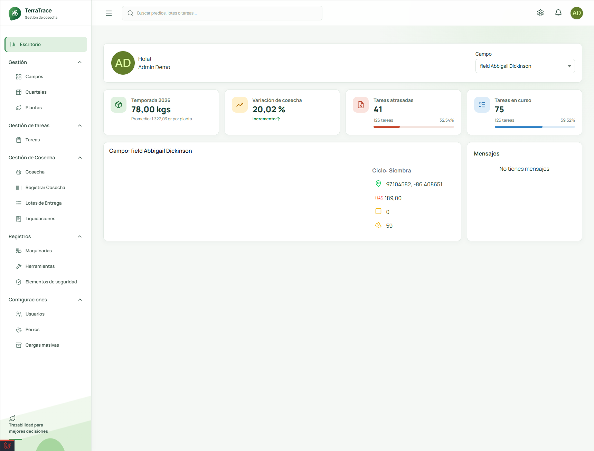
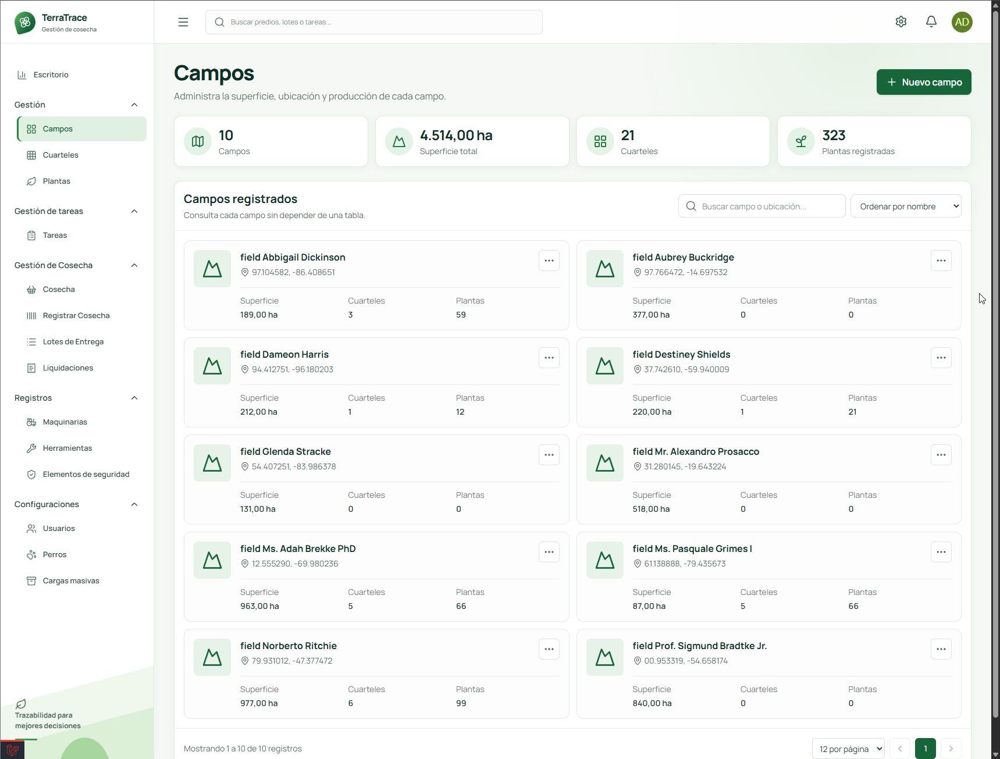
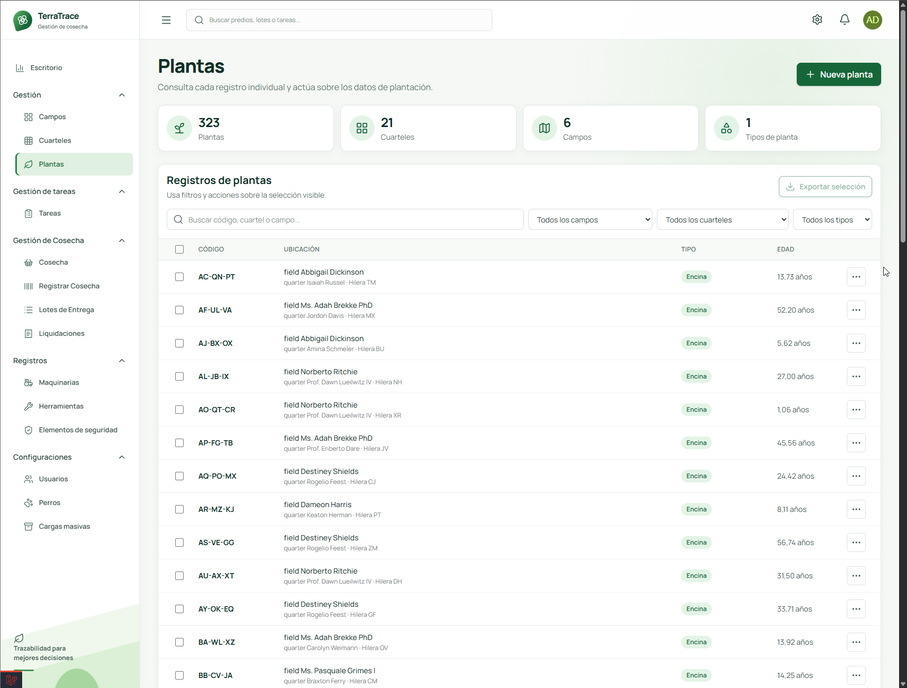
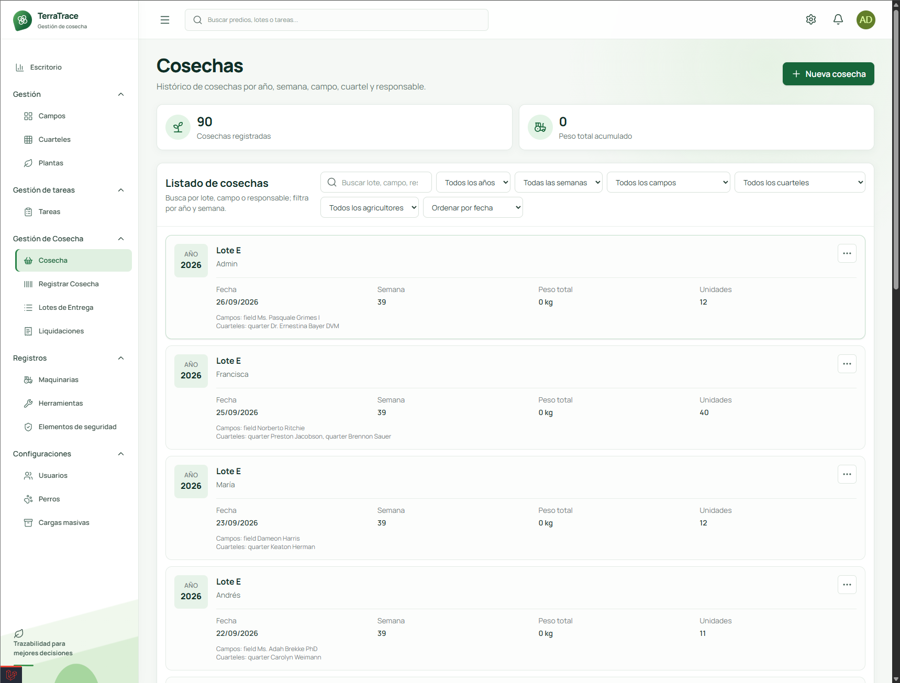
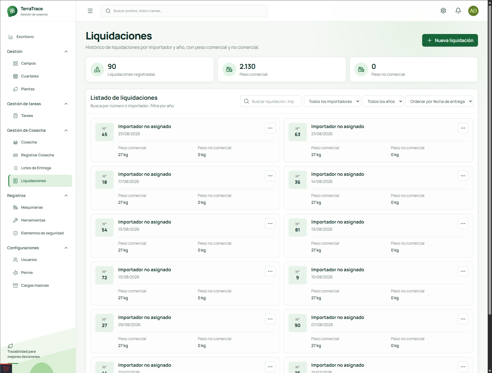

# TerraTrace

> Plataforma de gestión agrícola para registrar cosechas, mantener trazabilidad y consultar la operación desde el predio hasta la liquidación.

TerraTrace resuelve la fragmentación de información en operaciones agrícolas. Centraliza datos de campo, producción, inventario, tareas y resultados económicos en una interfaz web.


## Contexto

Las operaciones agrícolas suelen distribuir datos entre planillas, cuadernos y mensajes. Esta dispersión dificulta identificar el origen de cada lote y medir el resultado de una temporada.

TerraTrace organiza el flujo operativo en una sola aplicación. El proyecto prioriza trazabilidad, control de recursos y lectura rápida de indicadores.

```text
Predio → Cuartel → Planta → Cosecha → Lote → Inventario → Liquidación
```

## Vista rápida

| Reto | Respuesta en TerraTrace |
| --- | --- |
| Identificar el origen de la producción | Modela predios, cuarteles, plantas, cosechas y lotes. |
| Controlar la operación diaria | Gestiona tareas, comentarios, recursos y notificaciones. |
| Consolidar movimientos | Registra inventario, lotes y datos de trazabilidad. |
| Revisar el resultado | Presenta indicadores, gráficas y liquidaciones. |

## Galería

Capturas reales de la aplicación en ejecución. El flujo recorre las vistas principales en el orden `Escritorio → Campos → Plantas → Cosechas → Liquidaciones`.

### Escritorio



### Campos



### Plantas



### Cosechas



### Liquidaciones



## Capacidades

### Operación agrícola

- Administra predios, cuarteles, plantas y tipos de planta.
- Registra cosechas individuales y masivas.
- Consulta detalles de cosecha mediante códigos.
- Registra herramientas, maquinarias y elementos de seguridad.
- Mantiene bitácoras, archivos y documentación por entidad.

### Trazabilidad e inventario

- Relaciona plantas, cosechas, lotes y movimientos.
- Agrupa producción en lotes y lotes de cosecha.
- Consulta estados y ubicaciones del inventario.
- Permite integrar lectura de códigos QR en el flujo de cosecha.

### Gestión y análisis

- Asigna tareas y registra comentarios operativos.
- Entrega notificaciones para tareas pendientes.
- Visualiza indicadores de cosecha y carga operativa.
- Consolida liquidaciones y categorías comerciales.
- Genera gráficas para predios y operaciones.

### Acceso

- Protege rutas mediante autenticación Laravel.
- Gestiona permisos con `spatie/laravel-permission`.
- Incluye perfiles para agricultor, técnico, administrador y superadministrador.

## Decisiones de diseño

| Área | Decisión |
| --- | --- |
| Interfaz | Usa una navegación lateral agrícola con modo claro y oscuro. |
| Flujo | Mantiene las entidades de campo conectadas desde el predio hasta la liquidación. |
| Backend | Separa la aplicación en módulos por dominio. |
| Frontend | Combina Vue 3, Inertia y PrimeVue para una experiencia SPA con rutas Laravel. |
| Datos | Utiliza migraciones, seeders y factories para facilitar demostraciones locales. |

## Arquitectura

```text
Navegador
    │
Vue 3 + Inertia.js + PrimeVue + Tailwind CSS
    │
Laravel 12
    ├── Auth
    ├── Core
    ├── Dashboard
    ├── Fields
    ├── Tasks
    └── Users
    │
MySQL + migraciones + seeders
```

La estructura modular separa controladores, servicios, recursos, rutas y migraciones por dominio.

| Directorio | Propósito |
| --- | --- |
| `Modules/Auth` | Gestiona autenticación y recuperación de acceso. |
| `Modules/Core` | Centraliza componentes, layouts y servicios compartidos. |
| `Modules/Dashboard` | Entrega indicadores y paneles de operación. |
| `Modules/Fields` | Gestiona predios, plantas, cosechas e inventario. |
| `Modules/Tasks` | Gestiona tareas, comentarios y notificaciones. |
| `Modules/Users` | Gestiona usuarios, perfiles y permisos. |
| `docs/images` | Contiene las capturas de referencia. |

## Stack

| Capa | Tecnologías |
| --- | --- |
| Backend | PHP 8.1+, Laravel 12, Sanctum, Laravel Octane |
| Frontend | Vue 3, Inertia.js, Pinia, PrimeVue, Tailwind CSS |
| Visualización | ApexCharts, Material Symbols, Prime Icons |
| Datos | MySQL, Eloquent, migraciones, factories y seeders |
| Integraciones | Ziggy, Maatwebsite Excel, lector QR, jsPDF |
| Calidad | PHPUnit, Laravel Pint y Biome |

## Inicio local

### Requisitos

- Instala PHP 8.1 o superior.
- Instala Composer 2.
- Instala Node.js LTS y npm.
- Crea una base de datos MySQL vacía.

### Instala dependencias

```bash
git clone <URL_DEL_REPOSITORIO> terratrace
cd terratrace
copy .env.example .env
composer install
npm ci
```

Usa `cp .env.example .env` en macOS o Linux.

### Configura datos locales

Edita el archivo `.env` con las credenciales de una base de datos local. Usa `harvest_management_demo` como referencia para los nombres de ejemplo.

```bash
php artisan key:generate
php artisan migrate:fresh --seed
```

El seeder local crea una cuenta ficticia para demostraciones.

| Campo | Valor |
| --- | --- |
| Correo | `admin@example.cl` |
| Contraseña | `12345678` |

Usa esta cuenta solo en una base local desechable.

### Inicia el entorno

```bash
composer run dev
```

El comando inicia Laravel, la cola y Vite. Abre `http://localhost:9000`.

### Genera recursos de producción

```bash
npm run build
```

### Ejecuta pruebas

```bash
php artisan test
```

## Privacidad

- Usa datos ficticios en las capturas y seeders.
- Mantiene secretos y datos locales fuera del control de versiones.
- Evita usar credenciales de producción durante las demostraciones.
- Aplica políticas de acceso y retención antes de usar datos reales.

## Adaptación

Adapta TerraTrace a viñedos, berries, hortalizas, frutales, olivos o semillas. Ajusta los tipos de planta, atributos, estados y reglas de liquidación sin alterar el flujo principal.

## Licencia

No agregues una licencia de reutilización hasta contar con autorización del titular del proyecto.
